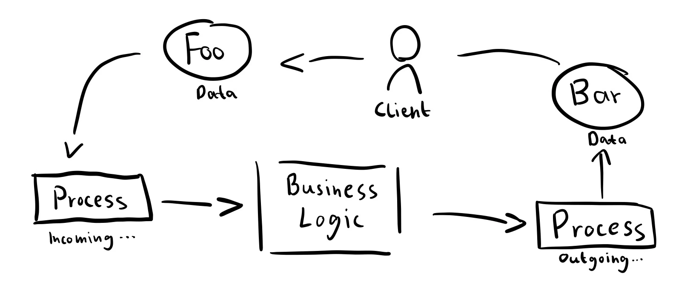

+++
title = 'Generic Web Handlers in Go'
date = 2024-07-21T12:12:12+02:00
published = true
tags = ['Software Engineering', 'Go', 'Web Development', 'Gwu']
+++

> The idea stems from a very interesting [Reddit thread](https://www.reddit.com/r/golang/comments/1dxat13/whats_a_really_good_blog_post_youve_read_lately/?utm_source=share&utm_medium=web3x&utm_name=web3xcss&utm_term=1&utm_content=share_button), which led me to [Willem Schots' blog post](https://www.willem.dev/articles/generic-http-handlers/), giving me a starting point for further advancing the idea of generic web handlers.

> Heads up: This post and implementation for generic web handlers focuses on APIs (with JSON). There is currently no other data-interchange format, HTML rendering, or templating implemented. I plan on extending this in the future. Please share your ideas with me! :)

The [code is publicly available on GitHub](https://github.com/reqlabs/gwu), with an [example poem API](https://github.com/reqlabs/gwu/tree/v0.1.0/examples/poem) showcasing the usage of [the initial version](https://github.com/reqlabs/gwu/tree/v0.1.0).

## Web Handlers in Go
I'll keep this simple, as I expect you to be familiar with the basics of Go and `net/http` already. Web handlers take an incoming HTTP request, perform some action, and write an HTTP response.

This "action" often involves some CRUD:
- *Create* an entity: Create a poem in a poem store.
- *Read* an entity: List all poems from that store.
- *Update* an entity: Update a poem in the store.
- *Delete* an entity: Delete a certain poem from that store.

For our `Create an entity` example, we might have a handler like this:
```go
mux.HandleFunc("POST /order", func CreateOrder(w http.ResponseWriter, r *http.Request) {
    var order Order
    if err := json.NewDecoder(r.Body).Decode(&order); err != nil { ... }

    if err := db.SaveOrder(order); err != nil { ... }

    w.Header().Set("Content-Type", "application/json")
    w.WriteHeader(http.StatusCreated)
    json.NewEncoder(w).Encode(order)
})
```

## The Beauty of the Idea
You might notice a potential pattern here:
1. Data comes in
2. Action is performed
3. Data goes out



This pattern will most likely be repeated in every handler, with only the specifics changing. Have you noticed it in your own code bases, maybe even written a helper function to reduce boilerplate?

The greatest thing: If we know that the output is always JSON, and the business logic can be arbitrary, same as the input, as long as it's processed to the business logic's satisfaction, we can abstract this pattern into a generic handler.

The very abstract pseudocode for this generic handler might look something like this:
```pseudo
function handle(r Request) -> Response {
    in = FromRequest[Poem](request)
    
    out = BusinessLogic[Poem](in)
    
    return IntoResponse(out)
}
```

A basic, working Go implementation of this pseudocode can be found in [Willem Schots' blog post](https://www.willem.dev/articles/generic-http-handlers/). However, I wanted to explore this idea further, so let's go.

## Upfront Considerations
The point where I immediately deviated from Schots' implementation was his definition of the generic handler function:
```go
// TargetFunc executes the business logic and transforms Input to Output.
type TargetFunc[In any, Out any] func(context.Context, In) (Out, error)

// Handle returns an http.HandlerFunc that executes the business logic using the provided TargetFunc.
func Handle[In any, Out any](f TargetFunc[In, Out]) http.Handler {
    return http.HandlerFunc(func(w http.ResponseWriter, r *http.Request) { ... })
}
```

What about the HTTP status codes? This question struck my mind. In Schots' example, the `Handle` func writes `http.StatusBadRequest` (400) to the response when the provided `TargetFunc` returns an error. However, I highly doubt that business logic only errors with bad requests. What about forbidden (403), not found (404), internal server error (500), etc.?

This might seem trivial but what's indicated here isn't: The executed `TargetFunc` is not service logic; it leaks to the outside and is therefore still `Handler` or `Controller` logic. Therefore, I also disagree with Schots' naming of `service.go` and `Service.CreateNote`/`Service.UpdateNote`.

A `TargetFunc` must be aware of its context: The errors it returns are visible to the client, and it might indicate the HTTP status code, which is written to the client on failure. Keep this in mind for later, when we define our own function signature.

Furthermore, Schots does not provide a way to modify the `In`. He states this himself:
> If you’re dealing with complex requests you could inject some kind of generic constructor function into the Handle function: `type ConstructorFunc[In any](r *http.Request) (In, error)`

This is not only important for complex requests but absolutely necessary if you provide certain info (like an ID) to your endpoint via query parameters. It can also be useful for validations, but we'll inspect that in more detail later.

Also, Schots misses, IMHO, some extra options to pass to a handler, like a logger. I'll touch on that later, again. ;)

## Generic Web Handlers
Now, with fundamentals and considerations out of the way, let's start to implement our own version of generic web handlers.

### Implementation
Firstly, from the incoming request, `In` must be constructed. We'll define the `CnIn[In]` (construct input) function signature like this:
```go
type CnIn[In any] func(*http.Request, HandleOpts) (In, error)
```

This allows for adapting the constructor to various scenarios, like path or query parameters, and JSON input. It's important that a `CnIn` function may only return errors that are safe to display to the client.

Furthermore, `CnIn` cannot return an HTTP status code. An error from the constructor will, in the current implementation, always induce an `http.StatusBadRequest`, expecting constructor errors to be the client's fault. I've thought of changing this behavior, but I don't see a good reason to do so yet.

Then, the function that actually executes the business logic can be defined as:
```go
type Exec[In, Out any] func(context.Context, In, HandleOpts) (Out, int, error)
```

Again, it takes input, does something, and returns output. Returned error messages are expected to be client-safe, so `Exec[In, Out]` is therefore still a Handler or Controller. Services, on the other hand, contain explicit business logic and may leak internal information.

Now, what is `HandleOpts`? `HandleOpts` are the functional options, passed to the `gwu.Handle` func we'll touch on in a sec. `HandleOpts` should be used to, e.g., set a logger, allowing contextual logging inside the endpoint's `Exec` func.
```go
type HandleOpts struct {
	Log Logger
}

type HandleOptsFunc func(opt *HandleOpts)

func Log(log Logger) HandleOptsFunc {
	return func(opt *HandleOpts) {
		opt.Log = log
	}
}
```

The `Handle[In, Out]` func is crucial now; it puts everything together:
```go
func Handle[In, Out any](inFn CnIn[In], fn Exec[In, Out], optFns ...HandleOptsFunc) http.Handler {
	var opts HandleOpts
	for _, fn := range optFns {
		fn(&opts)
	}

	if opts.Log == nil {
		opts.Log = slog.New(slog.NewTextHandler(os.Stderr, nil))
	}

	return http.HandlerFunc(func(w http.ResponseWriter, r *http.Request) {
		in, err := inFn(r, opts)
		if err != nil {
			http.Error(w, err.Error(), http.StatusBadRequest)
			return
		}

		out, code, err := fn(r.Context(), in, opts)
		if err != nil {
			http.Error(w, err.Error(), code)
			return
		}

		IntoJSON(w, opts.Log, out, code)
	})
}
```

We execute the input constructor with the response and options, the business logic with the context, input, and options, and lastly, parse everything into JSON and write it to the response.

Now, we can define commonly used `CnIn[In]` functions:
```go
// JSON CnIn decodes the request body into the given data type In.
func JSON[In any]() CnIn[In] {
	return func(r *http.Request, _ HandleOpts) (In, error) {
		var in In
		err := json.NewDecoder(r.Body).Decode(&in)
		if err != nil {
			return in, ErrDecodeRequest
		}

		return in, nil
	}
}

// PathVal CnIn reads a path value with the given key.
func PathVal(key string) CnIn[string] {
	return func(r *http.Request, _ HandleOpts) (string, error) {
		return r.PathValue(key), nil
	}
}

// Empty CnIn always returns nil and no error.
// Use Empty for endpoints that do not require input.
func Empty() CnIn[any] {
	return func(_ *http.Request, _ HandleOpts) (any, error) {
		return nil, nil
	}
}
```

Afterward, `In` is constructed and the business logic can be executed using `Exec`. This `Exec[In, Out]` might look like this:
```go
func (c *PoemController) ByID(_ context.Context, id ID, opts gwu.HandleOpts) (Poem, int, error) {
    poem, err := c.store.Poem(id)
    if err != nil {
        opts.Log.Debug("requested non-existent poem", "id", id)
        return poem, http.StatusNotFound, ErrNotFound
    }

    return poem, http.StatusOK, nil
}
```

Leveraging the flexibility of `Exec[In, Out]`, Gwu also provides a very simple yet powerful validation function out of the box:
```go
// ValIn Exec validates the input with the given validation function.
// If the validation fails, it returns an http.StatusBadRequest and the validation error.
// Afterward, it calls the given Exec function.
//
// Use ValIn to validate the input before executing the logic.
//
// ValIn expects the validation function to return an error that is safe to display to the client.
func ValIn[In, Out any](fn Exec[In, Out], fnVal func(in In) error) Exec[In, Out] {
	var out Out
	return func(ctx context.Context, in In, opts HandleOpts) (Out, int, error) {
		err := fnVal(in)
		if err != nil {
			return out, http.StatusBadRequest, err
		}

		return fn(ctx, in, opts)
	}
}
```

Now, you've seen almost all the important code of Gwu. Simple, right? So, let's examine how this could look in real applications.

### Demo
> Important: For a complete example, [see the code on GitHub](https://github.com/reqlabs/gwu/tree/v0.1.0/examples/poem).

Since our endpoint logic is aware of its HTTP context, we'll call it `Controller`. We'll also use Go's standard mux.
```go
// Initialize the controller with an in-memory store
ctrl := &Controller{store: make(map[string]Poem)}

// Create a handler using gwu.Handle
h := gwu.Handle(gwu.PathVal("name"), ctrl.ByName)

// Register the handler with the mux
mux.Handle("GET /poem/{name}", h)

// Handler function in the Controller
func (c *Controller) ByName(_ context.Context, name string, _ gwu.HandleOpts) (Poem, int, error) {
    poem, err := c.store.PoemByName(name)
    if err != nil {
        return poem, http.StatusNotFound, ErrNotFound
    }

    return poem, http.StatusOK, nil
}
```

Adding a creation route, including data model validation, is now as simple as this:
```go
type Poem struct { ... }

func ValidateToCreate(p Poem) error { ... }

mux.Handle("POST /poem", gwu.Handle(gwu.JSON[Poem](), gwu.ValIn(ctrl.Create, ValidateToCreate)))

func (c *PoemController) Create(_ context.Context, poem Poem, opts gwu.HandleOpts) (Poem, int, error) {
    poem.ID = NewID()
    err := c.store.Add(poem)
    if err != nil {
        opts.Log.Debug("could not create poem", "error", err, "poem", poem)
        return poem, http.StatusInternalServerError, ErrCouldNotCreate
    }
    
    return poem, http.StatusCreated, nil
}
```

Contextualized logging, by the way, is a great thing. You can add it like this:
```go
log := slog.New(slog.NewTextHandler(os.Stderr, nil))

mux.Handle("POST /poem", gwu.Handle(gwu.JSON[Poem](), gwu.ValIn(ctrl.Create, ValidateToCreate),
    gwu.Log(log.With("method", "POST", "route", "/poem"))),
)
```

## Gwu Is Born!
From this idea, you might have already noticed, a little package grew.

### The Idea
Gwu, short for Generic Web Utility, was conceived to provide a straightforward, no-nonsense approach to building web handlers in Go. Gwu offers utility functionality for web handler creation without bloat. The package is simple and relies solely on the Go standard library.

### What Does the Future Hold?
I hope to see Gwu evolving in a utility-style manner, focusing on practical, minimalistic additions. Gwu is not meant to be a comprehensive framework but rather a library of useful utilities. I aim to keep external dependencies minimal, relying primarily on the standard library. Any new features or functions will be designed to simplify common tasks without over-complicating the codebase. I am open to ideas and contributions from you ;).

## Discussion: Is This Too Complex?
Is this approach too complex? I don’t know, maybe it is. Let me know! I like the approach, even though it imposes some abstraction. I'm happy to be convinced otherwise if someone has a better approach. Your feedback is crucial. If you find the approach too complex or have suggestions for improvement, please share!

## Conclusion
In conclusion, don't take all of this too seriously. If you like the idea, give Gwu a spin. If not, feel free to ignore it, or better yet, tell me why!

Gwu is expected to grow and evolve. I will continue to incorporate my personal thoughts and best practices while experimenting with smart abstractions that fit well in a standard-compliant environment. The goal is not to create a comprehensive framework but to offer a utility library that provides helpful functionality wherever it’s needed. 

I hope to maintain these ideals throughout Gwu’s development journey, but only time will tell. I genuinely look forward to seeing contributions from the community. Your input might help to shape Gwu.

Thank you for taking the time to read about Gwu! Have an awesome day! :))